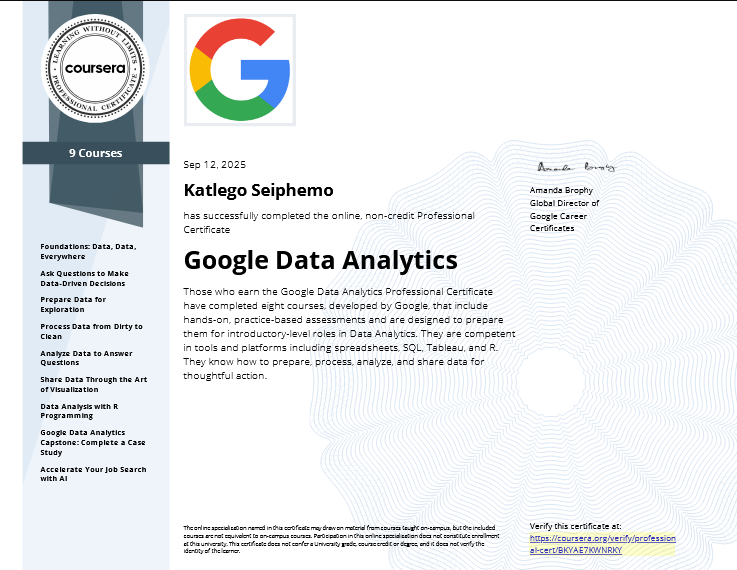
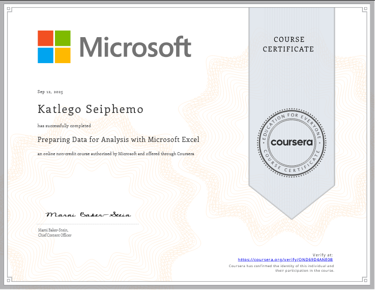
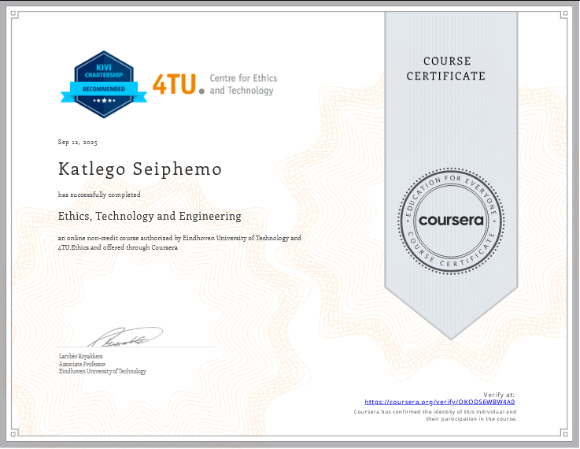
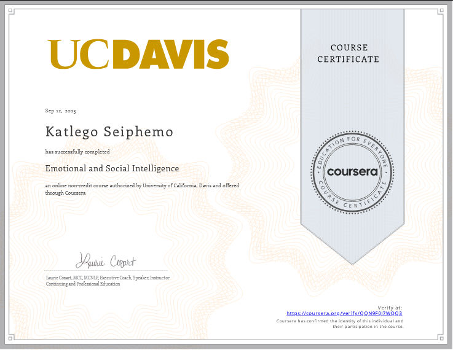
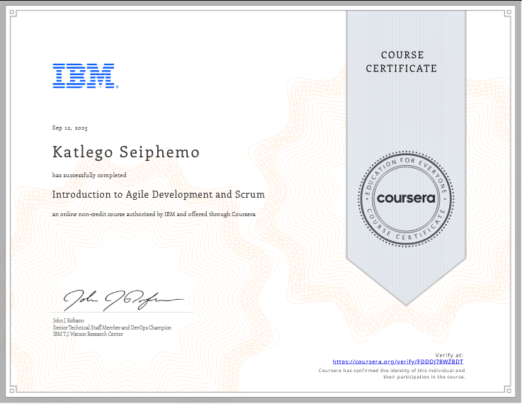
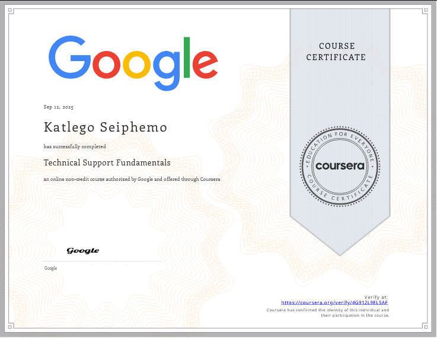
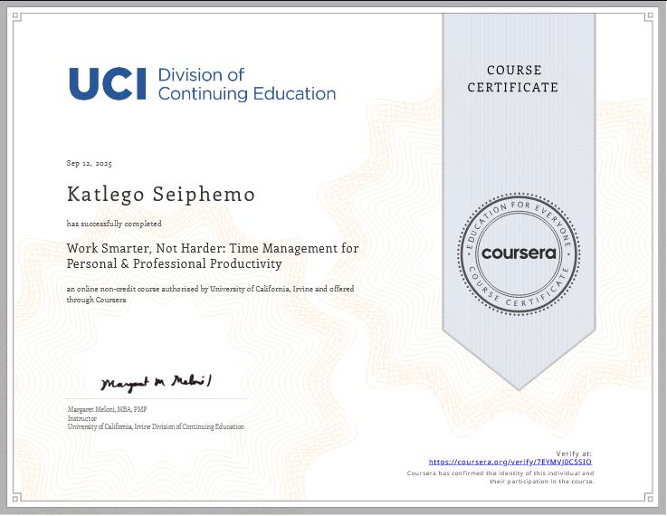

# Katlego Seiphemo 🇿🇦  
### Full-Stack Developer | Technical Support Specialist | 4 Years of Experience  

👋 Hi there! I'm Katlego, a dedicated and enthusiastic developer passionate about crafting seamless web experiences and solving complex technical challenges. With over four years of experience, I thrive on using technology to deliver exceptional user experiences and impactful solutions.

---

## 🚀 Tech Stack & Skills

### 🖥 Front-End
- HTML5, CSS3, JavaScript (ES6+)
- **React**, **TypeScript**
- Responsive Design & Cross-browser Compatibility

### 🔙 Back-End
- **Python** (Flask, Django)
- **Java** (Spring Boot)
- RESTful API Development & Integration

### 🧰 Tools & Frameworks
- Git & GitHub
- Node.js, NPM/Yarn
- Webpack, Babel
- Postman, Swagger

### 🗄 Databases & Cloud
- SQL (PostgreSQL, MySQL)
- NoSQL (MongoDB)
- Deployments on Heroku, Vercel, AWS (basic)

---

## 🌱 Currently Exploring
- Advanced back-end architecture & microservices
- Cloud-native apps and serverless functions
- DevOps practices: Docker, Kubernetes, CI/CD

---

## 🏆 **Certifications**  
### 📜 **SheCodes Coding Workshops**  
1.   
2.   

### 📜 **Coursera Certificate**  
1.   
2.   
3. 
4. 
5. 
6. 
7. 

---

## 🌐 **Portfolio**  
Explore my work: [Open My Portfolio](https://katlegoseiphemo.github.io/My-Portfolio/)  

---

📩 Feel free to connect with me for collaborations, projects, or just to chat about tech!  
